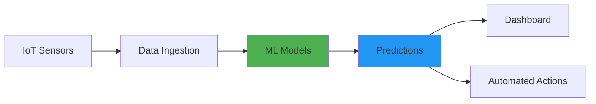
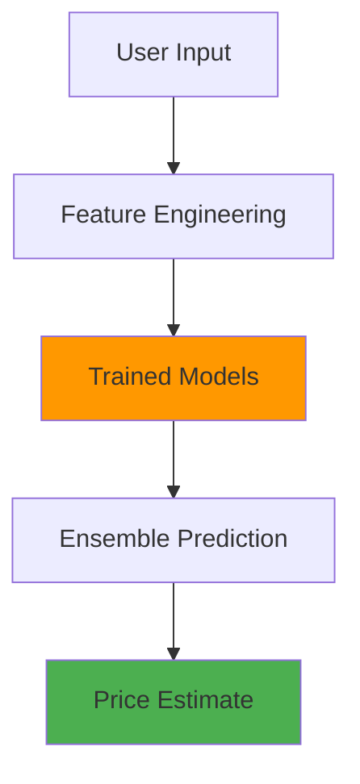
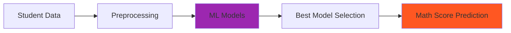

# 👋 Hi, I'm [Deputy Mashahary]

<div align="center">
  
[](https://git.io/typing-svg)

[](https://github.com/yourusername)
[](https://linkedin.com/in/yourprofile)
[](mailto:your.email@example.com)
[](https://yourportfolio.com)

</div>

---

## 🚀 About Me

```python
class MachineLearningEngineer:
    def __init__(self):
        self.name = "Your Name"
        self.role = "AI/ML Engineer & Full Stack Developer"
        self.location = "Kokrajahr, Assam, India"
        self.education = "Computer Science"
        
    def skills(self):
        return {
            "languages": ["Python", "JavaScript", "SQL"],
            "ml_frameworks": ["TensorFlow", "scikit-learn", "XGBoost", "Keras"],
            "web_frameworks": ["FastAPI", "Flask", "Django"],
            "databases": ["PostgreSQL", "MongoDB"],
            "tools": ["Docker", "Git", "Jupyter", "Prometheus"],
            "cloud": ["AWS", "Google Cloud", "Azure"]
        }
    
    def current_focus(self):
        return [
            "🔬 Deep Learning & Neural Networks",
            "⚡ Real-time ML Systems",
            "🌐 Full Stack ML Applications",
            "📊 Data Engineering Pipelines"
        ]
```

<div align="center">

### 💻 Tech Stack


</div>

---

## 🎯 Featured Projects

<div align="center">

### ⚡ AI Smart Grid Simulation System
*Intelligent Energy Management Platform with Real-time Analytics*

[](https://github.com/yourusername/smart-grid-simulation)
[](https://your-demo-link.com)

```
🤖 6 ML Models | 95% Accuracy | Real-time Processing | Docker Deployment
```

</div>

<table>
<tr>
<td width="50%">

#### 🔋 Key Features

- ⚡ **Load Forecasting** - LSTM & ensemble methods
- 💰 **Price Prediction** - XGBoost algorithm (MAE < $5/MWh)
- 🔍 **Theft Detection** - Isolation Forest (90%+ precision)
- ⚖️ **Grid Balancing** - Real-time supply-demand optimization
- 📊 **Load Shedding** - Intelligent demand management
- 🌊 **Streaming Data** - 100+ data points/second

</td>
<td width="50%">

#### 🛠️ Tech Stack

- **Backend:** FastAPI, Python
- **Frontend:** Django, Chart.js
- **ML:** TensorFlow, XGBoost, scikit-learn
- **Infrastructure:** Docker, Nginx, Prometheus
- **Data:** pandas, numpy, CSV streaming
- **Architecture:** Microservices

</td>
</tr>
</table>

<div align="center">



</div>

---

<div align="center">

### 🏠 House Price Prediction System
*ML-powered Real Estate Valuation Platform*

[](https://github.com/yourusername/house-price-prediction)
[](https://your-demo-link.com)

```
🏡 Multiple Algorithms | 92% R² Score | Interactive UI | RESTful API
```

</div>

<table>
<tr>
<td width="50%">

#### 🏘️ Key Features

- 🎯 **Accurate Predictions** - 92% R² score
- 🧮 **Multiple Models** - Random Forest, XGBoost, Gradient Boosting
- 🗺️ **Location Analysis** - Geographic feature engineering
- 📈 **Market Trends** - Historical price analysis
- 🎨 **Modern UI** - Responsive design with animations
- 🔄 **Auto-Update** - Periodic model retraining

</td>
<td width="50%">

#### 🛠️ Tech Stack

- **Framework:** Flask, Python
- **ML:** scikit-learn, XGBoost
- **Data:** pandas, numpy, matplotlib
- **Frontend:** HTML5, CSS3, JavaScript
- **Deployment:** Docker, Heroku
- **API:** RESTful endpoints

</td>
</tr>
</table>

<div align="center">



</div>

---

<div align="center">

### 🎓 Student Performance Prediction System
*Educational Analytics with Interactive Dashboard*

[](https://github.com/yourusername/student-performance-prediction)
[](https://your-demo-link.com)

```
📚 6 Algorithms Compared | 88% R² Score | Animated UI | Production Ready
```

</div>

<table>
<tr>
<td width="50%">

#### 📊 Key Features

- 🎯 **High Accuracy** - 88% R² score prediction
- 🔬 **Model Comparison** - 6 algorithms evaluated
- 🎨 **Interactive UI** - Glassmorphic design with animations
- ⚙️ **Auto-tuning** - GridSearchCV optimization
- 📝 **Comprehensive Logging** - Detailed error tracking
- 🔄 **Data Pipeline** - Automated preprocessing

</td>
<td width="50%">

#### 🛠️ Tech Stack

- **Framework:** Flask, Python
- **ML:** scikit-learn, XGBoost, AdaBoost
- **Processing:** pandas, numpy
- **Frontend:** HTML5, CSS3, JavaScript
- **Optimization:** GridSearchCV
- **Serialization:** pickle, dill

</td>
</tr>
</table>

<div align="center">



</div>

---

## 📊 GitHub Statistics

<div align="center">


</div>

<div align="center">

[](https://git.io/streak-stats)

</div>

---

## 🏆 Achievements & Certifications

<div align="center">

| 🎓 Certification | 🏢 Organization | 📅 Year |
|-----------------|----------------|---------|
| Machine Learning Specialization | Stanford/Coursera | 2024 |
| Deep Learning Specialization | deeplearning.ai | 2024 |
| AWS Certified ML Specialty | Amazon Web Services | 2024 |
| TensorFlow Developer Certificate | Google | 2023 |

</div>

---

## 📈 Activity Graph

<div align="center">

[](https://github.com/Heera)

</div>

---

## 🎯 Current Goals for 2025

```python
goals_2025 = {
    "🚀 Learning": [
        "Advanced MLOps & Model Deployment",
        "Large Language Models (LLMs)",
        "Kubernetes & Cloud Native Technologies"
    ],
    "💼 Professional": [
        "Contribute to 5+ Open Source ML Projects",
        "Build Production-Ready AI Systems",
        "Mentor Junior Developers"
    ],
    "🏆 Personal": [
        "Complete 10 End-to-End ML Projects",
        "Write Technical Blogs",
        "Speak at Tech Conferences"
    ]
}
```

---

## 📝 Latest Blog Posts

<!-- BLOG-POST-LIST:START -->
- 🔥 [Building Real-time ML Systems with FastAPI](https://yourblog.com/post1)
- 💡 [LSTM vs Traditional Methods for Time Series Forecasting](https://yourblog.com/post2)
- ⚡ [Deploying ML Models with Docker: A Complete Guide](https://yourblog.com/post3)
- 🎯 [Hyperparameter Tuning: GridSearch vs RandomSearch](https://yourblog.com/post4)
<!-- BLOG-POST-LIST:END -->

---

## 🤝 Let's Connect!

<div align="center">

I'm always interested in collaborating on innovative ML projects and discussing emerging technologies in AI!

[](https://linkedin.com/in/yourprofile)
[](https://twitter.com/yourhandle)
[](mailto:your.email@example.com)
[](https://yourportfolio.com)
[](https://medium.com/@yourhandle)

### 💬 Open to opportunities in:
**Machine Learning Engineering** | **AI Research** | **Full Stack Development** | **Data Science**

</div>

---

<div align="center">

### 📊 Profile Views


### ⭐ Show Some Love!

If you find my projects interesting, please consider giving them a ⭐ on GitHub!

---


**💼 Open for exciting opportunities and collaborations!**

*Last Updated: October 2025*

</div>
